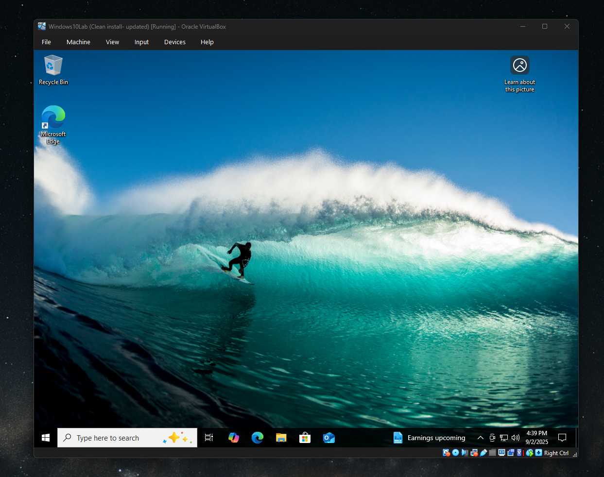
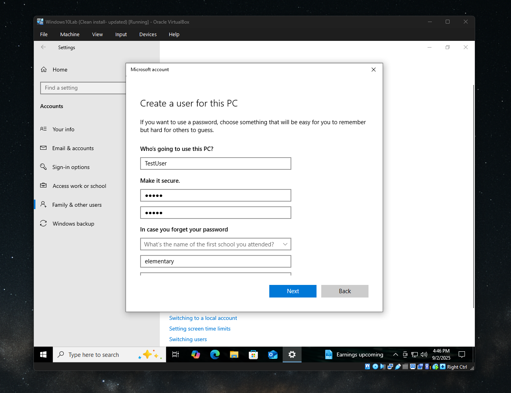
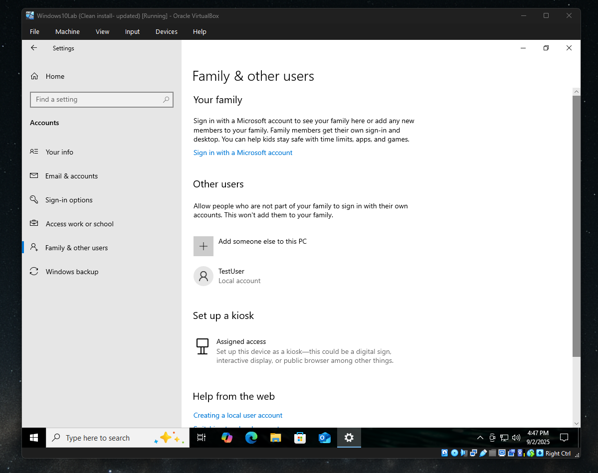
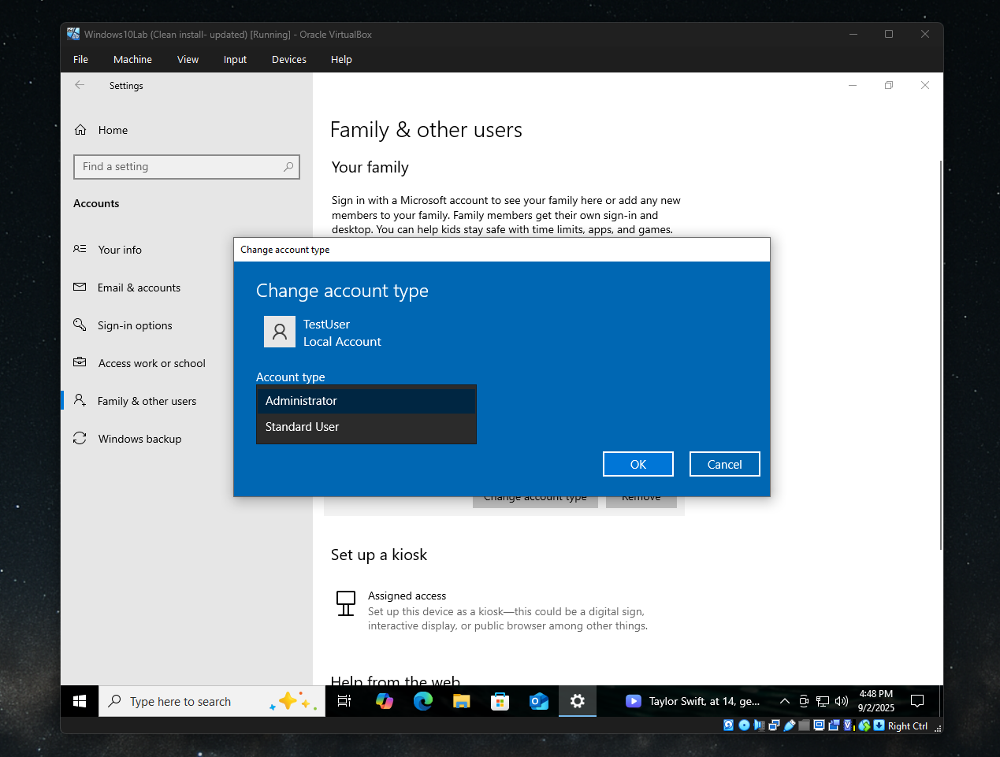
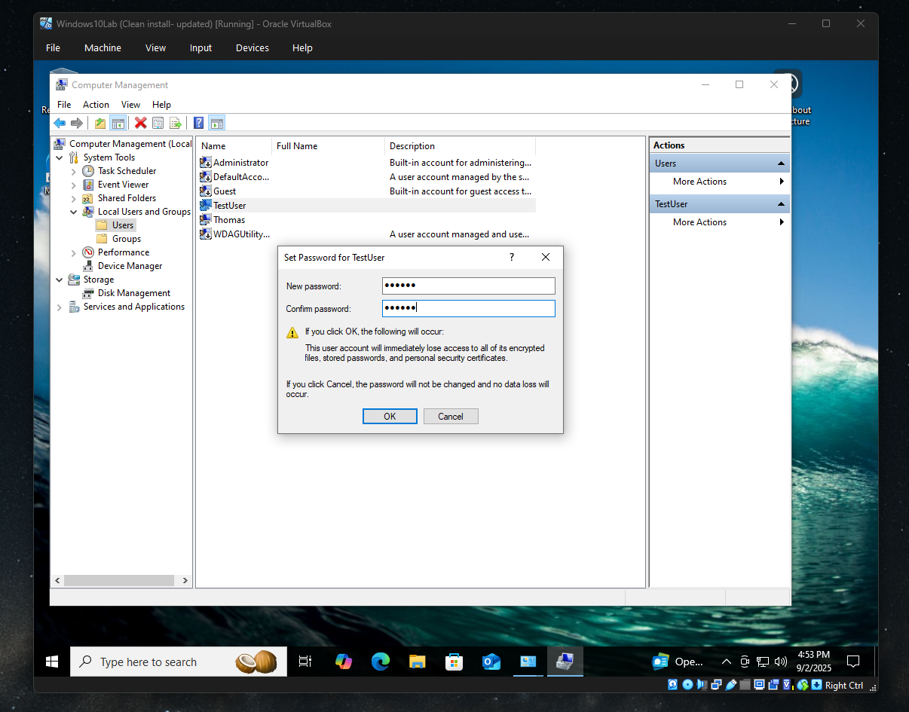

# Lab - User Accounts & Passwords

**Objective:** 
Practice creating and managing user accounts in Windows 10. Tasks include creating a local user, changing account types, and resetting a password.

## Steps & Screenshots

### Step 1 Log into VM
- Booted into Windows 10 VM with admin account (`LabUser`).  
-  
### Step 2 Add New User
- Created local user `TestUser` with password `pw123`.  
- 
-  
### Step 3 Change Account Type
- Elevated `TestUser` to Administrator.  
- Reverted back to Standard User.  
-   
### Step 4 Reset Password
- Opened **Computer Management** (`lusrmgr.msc`).  
- Right-clicked `TestUser` → Set Password.  
- Entered new password.  
-  

## Outcome
- Successfully created and managed users in a Windows 10 VM.  
- Practiced privilege changes and password resets, simulating common helpdesk tasks.  
- Demonstrated ability to use both Settings and Computer Management for account administration.  

---

## Files
- `labastep1.png`
- `labastep2.png`  
- `labastep3.png`  
- `labastep4.png`  
- `labastep5.png`  
